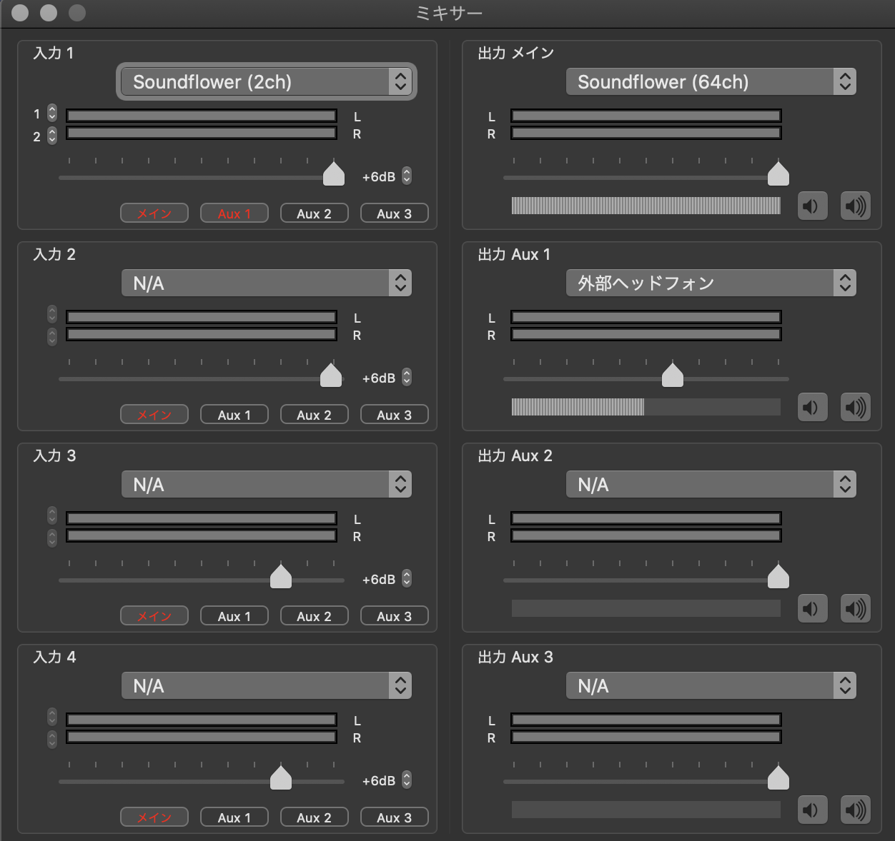
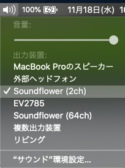

# 環境
- soundflower
- ladiocast

# 音声ミキサー設定

## 出力先を全部soundflowr(2ch)に集約する
### システム設定

「soundflowr(2ch)」に設定

### discord
「default」でいい
### ipad
システム音声全部が乗るようになる(ipadをQuickTimeに表示しているならipad音声も入るようになる)

## 入力をsoundflowr(2ch)に設定する
### input1 / 出力メイン
soundflowr(2ch)->soundflowr(64ch)
main/AUX1
### input2 / 出力AUX1
N/A -> 外部ヘッドホン
main

